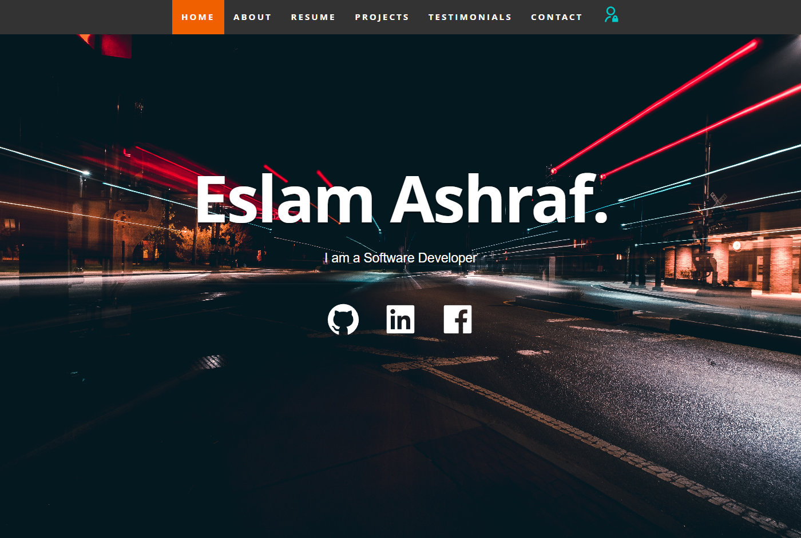
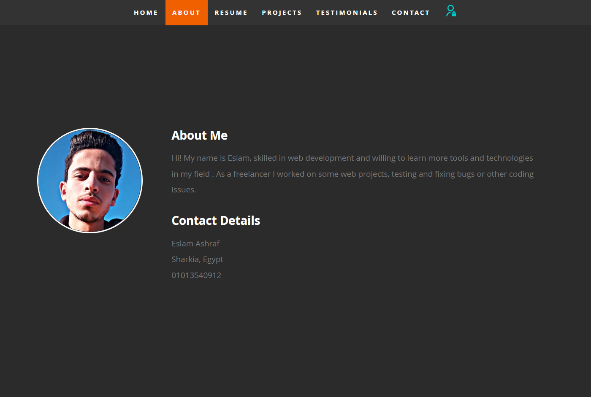
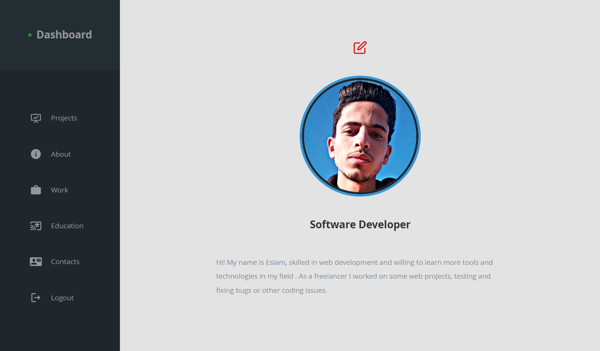
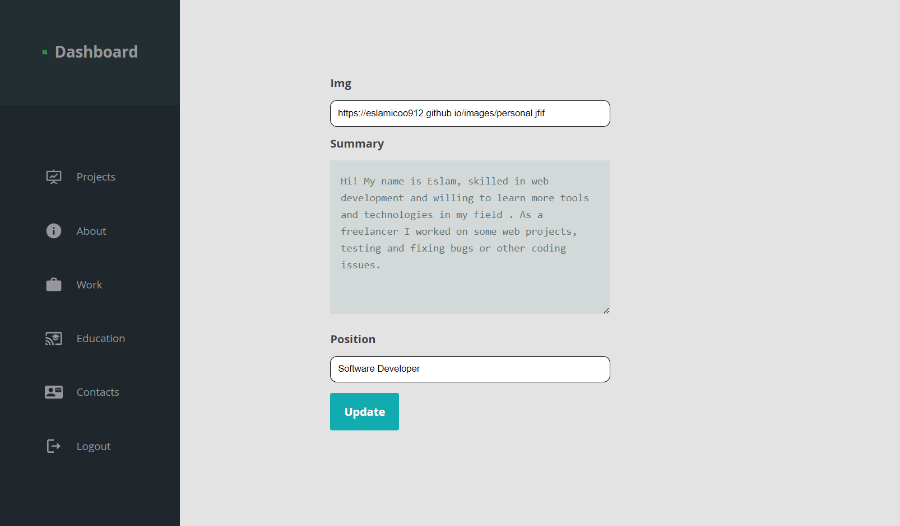
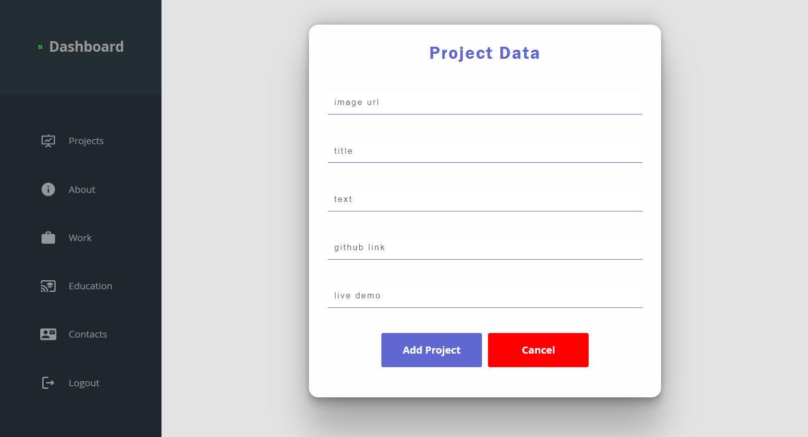
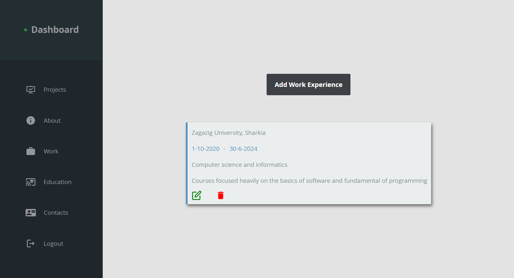
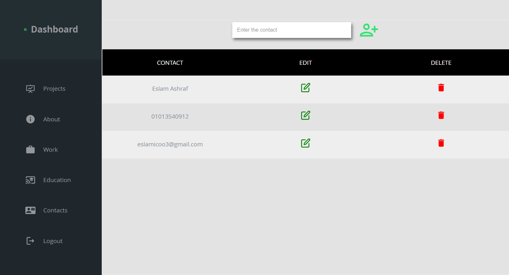

# A Full Stack Portfolio With Dashboard

Hello, friends!
This is a portfolio with a dashboard developed by MERN stack.
The reason why I developed this project is to manage and control my skills, education, work experiences, contacts, and projects.

# Contents

### Projetc Description

### Installation

### Usage

Let's start explaining how to install and use this project.

# Projetc Description

- This project is developed in two sections (backend and fronend).
- The backend is responsible for creating APIs, handling database, and running CRUD operations.
- The frontend section is used for rendering the APIs created by the backend and styling them
  to be displayed on the screen as HTML elements
- In the home page I can login as the admin.
- The admin only has the authorization to go to the dashboard.
- Once I logged in as admin, I can manage my whole portfolio and add / edit / update / delete any information.
- Once I did any operation in the dashboard, the new information is updated on the portfolio pages.

# Installation

- This project is developed using Node.js and React.js .
- You should have Node Package Manager ( **npm** ) installed on your device.
- Once you downloaded the repo on your local machine, run the following commands
- For **server** folder: `npm run start` to start the server.
- For **client** folder: `npm start` to start react app.

# Usage

- To login as admin use `admin` for the username, and `admin` for the password.
- Don't worry about using the dashboard, it is simble and easy to use.
